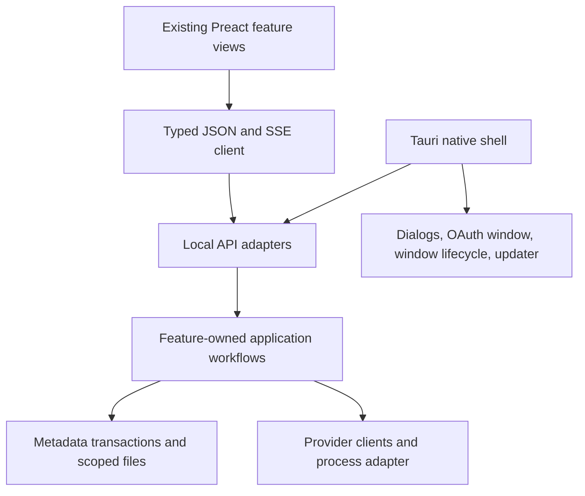

# Feature-owned rewrite

Status: accepted for implementation, originally prepared 2026-09-08. Accepted product scope: all non-Guardian parity. Technical choices below still require the indicated implementation evidence.

## Context

The baseline already has useful Preact feature views, loader providers, version interpreters, Java runtime boundaries, and launch planning. Complexity concentrates where `Application`, `State`, `Execution`, Guardian, Performance, persistence, and transport ownership intersect. See [baseline architecture](../../legacy/docs/ARCHITECTURE.md), [replacement conventions](../CONVENTIONS.md), and [baseline route inventory](../../legacy/apps/api/src/routes/route-manifest.tsv).

A rewrite that retains all non-Guardian behavior still includes substantive content, account, filesystem, Performance, and release workflows. Fewer crate names cannot eliminate their required guarantees. The design should reduce cross-feature concepts and handwritten duplication while retaining proven domain knowledge.

## Decision

The rewrite began on `feat/clean-rewrite`, with the preserved baseline under `legacy/` and replacement code at the root. Development now continues directly on `main`, as authorized by the user, preserving every commit; the earlier branch remains a recovery checkpoint. Use a distinct development application identity and data root. Keep Rust, Tokio, Preact/Signals, Tauri, and the browser development workflow. Carry proven leaf algorithms and UI components through behavioral checks. Avoid a simultaneous redesign of the interface.

The user explicitly requires UI preservation. Adapt existing clients and state bindings in place; retain layout, CSS, visual assets, component APIs, navigation and interaction semantics. Do not move view directories just to match the backend organization. Small polish is separate from architecture work and requires a concrete observed problem plus focused before/after validation.

Use three logical production boundaries, with a proposed consolidation into `core/app`, `apps/api`, and `apps/desktop`. A retained leaf crate may remain separate when moving it would add risk or work without reducing coupling. Crate count is a consequence, not an acceptance target.

All arrows represent local calls except the HTTP client and provider network requests. Features are in-process modules. No microservices, internal RPC mesh, broker, event-sourced platform, dependency injection container, plugin ABI, or distributed database is introduced.

## Module ownership

Proposed paths describe the replacement checkout, not files that already exist.

| Owner | Proposed boundary | Owns | Does not own |
| --- | --- | --- | --- |
| Composition | `core/app/src/lib.rs` | Explicit construction and shutdown order | Business rules or a service locator passed to every feature |
| Metadata | `core/app/src/storage/` | Connection, migrations, transaction execution | Feature decisions or network calls |
| Managed files | `core/app/src/files/` | Scoped roots, portable names, bounded reads, publication primitives | Repair policy or inferred user-file ownership |
| Library lifecycle | `core/app/src/library.rs` | Application-root lifetime, current/retiring library generations, root switch/reset admission and retained pins | Generic repair policy or copying authority from stored paths |
| Accounts | `core/app/src/accounts/` | Identity, selection, credential references, refresh, profile fences | Skin library state or plaintext token export |
| Versions and loaders | `core/app/src/catalog/`, `core/app/src/loaders/` | Normalization, compatibility records, loader materialization | UI parsing of provider data |
| Java | `core/app/src/runtime/` | Discovery, probe, ordinary provisioning | Silent overrides or recovery decisions |
| Instances | `core/app/src/instances/` | Registry and create/duplicate/delete workflows | Mod/provider rules |
| Installation | `core/app/src/install/` | Queue and game/runtime/loader publication coordination | Universal recovery engine |
| Launch | `core/app/src/launch/` | Private command planning, session ownership, process lifecycle, logs | Automatic relaunch or Guardian diagnosis |
| Content | `core/app/src/content/` | Search, dependency plans, provenance, mutations, packs | Writing another feature's tables |
| Skins/media | `core/app/src/skins/`, `core/app/src/media/` | Normalization, library, lookup, account-bound changes | Global account selection |
| Resources | `core/app/src/resources/` | Mod files, worlds, screenshots, log access | Independent destructive-root discovery |
| Performance | `core/app/src/performance/` | Rules, plans, health, managed mutation/rollback and benchmark behavior | Guardian autonomous intervention |
| UI | existing `frontend/src/views/`, `machines/`, `ui/` | Presentation, drafts and interaction workflows | Readiness, retry policy, exit classification |
| Transport/shell | `apps/api/`, `apps/desktop/` | Adaptation, capability checks, native OS actions | Duplicate feature state |

Feature modules expose small explicit functions and immutable snapshots. Each feature owns its queries and table definitions; the metadata owner coordinates migration order and transactions. Cross-feature writes use the owning feature's command. No catch-all `AppState`, global repository, or generalized `execute(action)` API is introduced.

## Contracts before implementation

The table below describes eventual contract requirements. The first offline executable slice fixes only identity, public errors, basic settings/offline account selection, version/runtime inputs, install snapshots and launch snapshots, plus their required private file/lifetime interfaces. Content plans, online/profile changes, Performance checkpoints and native media contracts settle when their feature families begin. There is no requirement to finish the entire future API first.

| Contract | Required semantics |
| --- | --- |
| Identity | Validated opaque instance/account/operation IDs. Display names and caller paths never confer filesystem authority. |
| Public error | Bounded typed code, safe text and domain-owned actions. Preserve the existing `{error: string}` envelope where used; additions are explicitly versioned in the replacement client. |
| Install snapshot | Install identity, revision, queue membership, phase, progress, explicit terminal outcome and allowed actions. Queued-item removal and active cancellation are distinct. |
| Launch snapshot | Session identity, revision, phase, process liveness, stop authority, terminal outcome. Process exit and output drainage are separate internal facts. |
| Account snapshot | Account identity, selection revision, account/profile/credential revisions, usable identity and allowed actions. Provider completions apply only to their captured identity and revision. |
| Loader record | Component identity, opaque build identity, supported Minecraft identities, freshness, normalized labels and artifact requirements. |
| Content plan | Exact target/version/loader, resolved dependency closure, file effects, conflicts, provenance, and expiry/precondition fingerprint. Revalidate before mutation. |
| Performance operation | Registered instance, exact plan or snapshot, domain-owned checkpoints, result and compensation status; ambiguity never becomes success. |
| Native file selection | Bounded admitted bytes or an expiring single-use reference; selecting a path does not authorize unrelated reads. |

Rust public DTOs are the authored wire schema. Generate TypeScript per domain with one maintained tool. Preserve runtime validation on provider, persisted, and transport input. Do not export internal journal types, commands, credentials, or filesystem capabilities. Verify actual Rust serialization against independent examples, especially omitted fields, explicit nulls, enums, and numeric bounds. Generated TypeScript alone does not validate received JSON.

Feature implementations contribute local routes and DTOs. One composition owner registers them and updates the shared client entrypoints; contract changes land before consumers depend on them.

## One domain transport

JSON requests already use the local API in both browser and desktop. Use that same authenticated boundary and SSE for domain progress. Keep native IPC for bootstrap, window actions, admitted files, OAuth windows, and package-aware update/restart. Preserve per-process capabilities, exact-origin admission, media scoping, and fresh one-use stream tickets on reconnect.

A subscription atomically couples a current snapshot to subsequent events, carries monotonically increasing revisions, and rebases on loss. UI reconnection can retry reads; it cannot repeat a mutation to infer its outcome. Accepted mutations use an intent key when necessary to prevent duplicates after an uncertain response. Retain status reads as authoritative recovery.

Prove HTTP/media/SSE in installed WebViews on each existing artifact architecture. Browser fixtures alone are insufficient. Until that passes, retain the current transport in the baseline checkout. If a concrete WebView limit blocks parity, document it and choose a narrow adapter; never silently maintain two independent state authorities.

Tauri capabilities remain scoped to the relevant window and OS action. [Tauri capability documentation](https://v2.tauri.app/security/capabilities/) describes that boundary. A single transport still requires native integration tests.

## Lifetime and concurrency

Share a small task owner for cancellation, joining, bounded scheduling and latest public projections. Keep install, launch, import, profile change, update, and Performance state machines domain-specific. A public job summary is a view; it is not the source of durable recovery.

- Request cancellation drops the waiter; accepted work keeps its owner until effects settle.
- Acquire target exclusion before launch, deletion, content/Performance mutation, and other conflicting work. Unrelated instances may progress independently.
- Shared library and runtime mutations additionally coordinate by exact artifact/root identity; per-instance locks alone are insufficient.
- Define a fixed lock acquisition order. Short implementation locks and database transactions protect memory/metadata updates and are released before network/process I/O. Retained admission leases are different: they survive the entire accepted operation/process and any unresolved settlement, preserving exclusion without holding a memory mutex during I/O.
- Cancellation accepted before publication leaves no published effect. Once publication wins, finish or visibly retain settlement; do not report cancelled while silently committing later.
- Terminal state is published once per operation incarnation. A stale completion cannot affect a reused ID, selected account, or new install.
- Stop and shutdown must terminate/reap the owned process tree, then settle output and persistence. Do not infer tree ownership from a direct-child kill API.
- Close/update behavior preserves user-visible refusal while active work exists, with bounded explicit recovery for hung work. Never force an updater through unsettled mutations.

## Storage and recovery

Prefer one SQLite metadata database if a storage experiment demonstrates removal of existing custom store/coordinator code. Start with a direct, bounded connection owner and feature-local SQL. Do not add an ORM or generic repository layer by default. Choose journaling/durability settings using actual local filesystem support; do not promise hardware power-loss behavior beyond tested guarantees.

SQLite atomic commit covers database transactions; file payloads still need their own recovery protocol. [SQLite atomic commit documentation](https://www.sqlite.org/atomiccommit.html).

| Workflow | Commit protocol | Recovery requirement |
| --- | --- | --- |
| New version/runtime | Persist typed pending intent; stage on target volume; verify exact manifest; publish to fresh owned destination; commit ready reference | A crash between publication and metadata commit is identified by intent and receipt; complete verified commit or preserve ambiguity. Previous ready data remains usable. |
| Import/duplicate | Reserve non-live identity; copy into owned staging; verify source/copy; promote; commit visible registry last | Rerun is idempotent. Identify promoted-but-unregistered destinations from a bounded import receipt; never adopt an unknown directory. |
| Instance deletion | Capture explicit keep/delete-files intent and exact identity; stage delete with domain-specific metadata/tombstone; commit logical removal; settle owned cleanup | Preserve precommit restore and postcommit cleanup semantics. Missing, replaced or conflicting identities cause preservation, not guessed deletion. Keep-files has no file-delete authority. |
| Content/Performance batch | Persist exact before/after manifest for affected owned files; stage replacements; apply with identity checks; commit or compensate | Mutable instances cannot be replaced wholesale. Interrupted batch retains per-file obligations, refuses conflicting mutation, and never discards user changes. |
| Keyring profile change | Account metadata and keyring references use explicit revisions; publish accepted credential change only after secure store acknowledgement | Handle ambiguous writes and logout/refresh races without resurrecting removed credentials. |

These are concrete feature protocols. Share only proven primitives such as bounded reads, checksums, staging and exclusive publication. Reuse necessary existing capability-safe filesystem code through narrow adapters; reducing handwritten code is not permission to replace it with unchecked path joins.

Keep existing-library selection and lifecycle behavior in scope. Reusing or importing a reference never grants authority to modify user-owned or unknown files. Metadata remains under the application root; external payload locations are admitted through a dedicated owner.

The library-lifecycle owner retains the current and retiring physical root generations. An accepted operation, escaped guard or receipt pins its exact generation until settlement; changing library configuration closes admission and cannot revoke a live pin. Root reset additionally joins application-owned work and retained capabilities before clearing the isolated root. Reuse the current runtime/root authority through a narrow adapter. Verify switch/reset races with active downloads, sessions, filesystem work and escaped receipts; per-instance locks alone do not satisfy this invariant.

## Guardian removal with Performance retained

Extract hard readiness, JVM/runtime validation, redaction, ownership and durable-settlement checks from Guardian into their actual feature owners. Omit Guardian modes, diagnosis/action fusion, automatic repair/relaunch, suppression history, idle repair and discretionary quarantine.

Performance plans, user-selected managed defaults, explicit apply/reapply/remove/rollback, health, rules, benchmarks and non-Guardian evidence remain. A failed or interrupted Performance transaction must compensate or retain its exact unresolved state. This is transaction correctness and remains mandatory even though Guardian is deferred.

Ordinary Play consumes the selected mode's launch settings and settles prior obligations; it does not implicitly apply or remove a mod bundle. The preserved launch entrypoint and runner leave those mutations to explicit Performance workflows. A selected Managed plan is not permission to replace content-owned mods.

Preserve current entrypoints, including internal/developer consumers. Existing backend action availability is not proof that a corresponding UI button exists; do not invent screens just to expose every endpoint. Remove only Guardian fields from mixed contracts. `ui/look-guardian.ts` is visual palette logic and remains.

Do not reserve a Guardian plugin/trait framework. Neutral diagnostics and feature commands already provide a future extension boundary. Any later recovery policy must request effects from those feature owners.

## Reuse and elegance

- Preserve UI primitives, assets, feature views and existing interaction machines where they already have one owner.
- Port provider parsing, Minecraft semantics, Java rules and command construction behind retained fixtures; unwrap effects before calling a planner pure.
- Consolidate repeated transport and wire-shape code. Keep separate state machines when their lifetimes differ.
- Prefer established libraries for SQLite, wire generation, cryptographic primitives and supported package updates after a narrow compatibility experiment.
- Do not turn every function into an interface. Use test seams at real I/O boundaries; use normal functions and enums inside a feature.
- Review every new background loop, durable table, generic type and dependency for a concrete retained behavior. Remove replaced code when its successor passes the same acceptance cases.
- Track handwritten production code, generated code, tests and tooling separately. No arbitrary LOC target or code-golf acceptance criterion is imposed.

## Updates and delivery

Preserve check, download, verification, staging, apply, restart, busy refusal and failure recovery. Prefer supported package-aware installation and signature verification to a custom executable replacement protocol where compatible. Tauri's updater requires signed update artifacts; adapting to it needs release-pipeline and installed-update evidence. [Tauri updater documentation](https://v2.tauri.app/plugin/updater/).

Artifact format changes require an explicit compatibility handoff for already distributed versions. Signing identities and external release publication are release inputs, not assumed available. Compile/package tests do not establish installed UI or update behavior.

## Consequences and alternatives

This architecture permits independent feature work after small shared contracts exist. Root wiring, schema coordination, generated bindings, dependency lockfiles and final integration remain serialized responsibilities. These are real limits on elapsed time.

Rejected as defaults: microservices (extra runtime/operational state), total UI rewrite (unnecessary parity work), universal job journal (cross-feature coupling), copying old orchestration wholesale (Guardian coupling), and reducing the product to Vanilla/Fabric (contradicts accepted scope).

If metadata or transport experiments do not simplify the implementation while preserving behavior, retain the existing narrow mechanism. The objective is reduced maintenance work, not adherence to a preselected architecture diagram.
