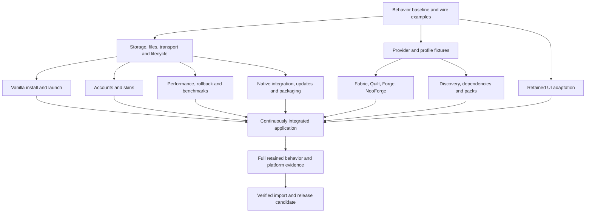

# Delivery plan

Status: implementation in progress on `main`; the user authorized history-preserving integration on 2026-09-28. Scope and evidence rules are in [README](README.md) and [parity requirements](parity.md). The [work package inventory](work-packages.json) is the machine-readable dependency and ownership list. [Current integration status](results/integration.md) records verified results and remaining gaps.

## Working shape

The user selected a new branch with the original project moved intact into `legacy/`. The replacement occupies the branch root and uses a separate application profile. Preserve the baseline at the recorded commit with separate fixtures and data. Do not create a second implementation inside the baseline runtime, dual-write old stores, or switch the user's installed application during development.

Each package is a bounded behavior change. It declares dependencies, exclusively owned target paths, inputs, acceptance checks, and required evidence. The paths describe the replacement tree; source references remain the baseline evidence. `planned` is not `ready` or `verified`.

## Initial executable foundation

First capture the baseline behaviors and settle only the contracts needed by an offline vanilla journey. In parallel, inspect provider fixtures, native packaging, existing UI interactions, and legacy data fixtures without depending on unfinished feature implementations.

The foundation must produce:

- A compileable replacement composition and distinct data identity.
- Public wire examples and deterministic generated frontend types with runtime boundary validation.
- Minimal profile persistence and scoped files with defined interrupted-publication behavior.
- One cancellation/join owner and domain-specific install/session snapshots.
- A real local API and packaged shell proving authenticated JSON, media and SSE.
- Fixed provider fixtures, fake Java, isolated profiles and a first observable acceptance case.

Do not spend a milestone building every possible model, screen, or recovery abstraction. The first mergeable product result is: create a vanilla instance, obtain Java and game files, launch, stream status/logs, stop, restart the app, and relaunch.

The first journey uses the real offline account directory and Vanilla performance mode. `game-sessions` owns process/session mechanics; `launch-coordination` owns preparation and cross-feature calls. Its offline checkpoint can pass before online auth, skin flush and managed Performance branches are complete. The package remains incomplete until those retained branches integrate. Do not use fake account or Performance success in the real offline checkpoint.

## Dependency scheduling

The package graph distinguishes `start_after` (contracts/fixtures available) from `finish_after` (real dependencies integrated). A UI or provider package may develop against reviewed wire fixtures after its start dependencies pass. It cannot be called complete before its actual producer and consumer integrate. Fixture-only output never satisfies feature parity.

Contract readiness includes the named producer's private interfaces needed by the consumer, not just public JSON DTOs. For example, instance work needs reviewed metadata, scoped-file, library-generation and operation-lease interfaces. Publishing that small interface can unblock development before the producer's implementation is complete. Initial queue/coordinator work needs only the Vanilla/offline subset; later loader, online, profile and Performance branches obtain their reviewed producer interfaces before those branches begin. Their full integration remains mandatory for package completion.

The build skeleton and fixture capture can begin immediately. The first shared contracts compile against that skeleton. Queue and launch coordination have explicit early Vanilla/offline checkpoints; full queue completion still requires all four loaders through the real API, and full launch consumers require preparation through the coordinator.

Every ready independent package may proceed. Prefer packages that unblock multiple consumers or close the first full journey. More concurrent changes do not shorten a blocked dependency path.

## Exclusive ownership

| Shared surface | Owner | Coordination |
| --- | --- | --- |
| Cargo workspace/manifests/lockfile, frontend manifest/lockfile, toolchain and Task/CI wiring | Foundation/build integration | Collect dependency requests, choose once, regenerate together |
| App construction, Rust root exports, API registration, startup/shutdown ordering | Composition integration | Feature modules deliver local router/constructor and small registration patch |
| Shared frontend shell, bootstrap, state/client entrypoints and CSS import order | UI integration | Feature views consume named clients/snapshots; shared edits are integrated once |
| Database connection and migration registry | Metadata integration | Features own table SQL; one owner orders schema migrations and cross-table transactions |
| Public wire generation and contract examples | Contract integration | Add narrow domain exports; consumers use generated output without hand editing it |
| Release aggregation and final evidence | Delivery integration | One serialized final build/publisher flow per candidate |

Owned paths in the package inventory must not overlap for concurrent edits. Small root registration changes are always submitted to their shared owner. A package can request a contract extension; it cannot silently change the type or copy it locally. Resource domains receive separate modules because the old shared resources file otherwise blocks independent changes.

Frontend packages adapt the existing UI rather than recreate screens. Reuse current view paths, CSS and component structure; only split an internal helper when required for ownership or state correctness. Capture the existing interface before adaptation. Any intentional visible difference needs a specific polish rationale and its own focused review; incidental layout or interaction drift is a regression.

Implementation currently uses one branch with exclusive file ownership and serialized shared integration. Separate worktrees remain an option for work that cannot avoid shared-file conflicts. Do not share mutable generated output directories or Cargo target writers without supported isolation. On the current tooling, target writers use a fail-fast lease: queue builds against the shared target; do not bypass its lock. Run independent source review and fixture preparation while builds are queued.

Integrate small coherent changes continuously. Keep at most two completed packages waiting for integration per feature family; finish integration before starting more work in that family. Root owners are responsibilities, not extra layers in the runtime.

## Reusable package handoff

Every implementation starts from the latest passing integration baseline and receives:

1. Its behavior, retained scope, and explicit exclusions from the coverage inventory.
2. Its public contract revision and reviewed input/output fixtures.
3. Its exclusive files plus dependencies and shared-owner requests.
4. Positive, invalid-input, external-failure, cancellation and restart acceptance where applicable.
5. Exact expected file effects and forbidden effects on unrelated data.

Every implementation returns code, focused tests, a short behavioral rationale, affected contract changes, evidence, and replaced-code removal. Independent review checks the actual outcome and tries to falsify the success claim. Returning code that merely compiles is insufficient.

## Completion gates

| Gate | Required result |
| --- | --- |
| Prepared | Baseline source and all known entrypoints mapped; contracts and unknowns visible; dependency graph valid |
| Contract-ready | Actual exported types/examples compile, producer and consumer agree on null/omission and errors, fixtures have independent expected outcomes |
| Feature-complete | Retained behavior passes focused domain and interface checks with real local dependencies; failure boundaries hold |
| Integrated | Feature works in the continuously assembled app; shared state and cross-feature invalidation work; no unexplained semantic differences |
| Release-ready | All retained coverage rows have evidence, four existing artifact architectures pass installed workflows, import/update interruption cases pass |

Offline vanilla is an early gate, not a narrowed release. Full loader, content, accounts/media, resource, Performance, personalization, developer and delivery parity remain release requirements. A partial feature may remain hidden while being integrated, but it cannot disappear from the inventory.

Shell completion supplies an initial packaged transport/lifecycle proof on the available development host. The artifact-delivery package owns producing and testing the complete installed architecture matrix. Do not require that final matrix as a prerequisite to producing its own artifacts. Native domain event pumps are retired only after matrix transport evidence passes.

## Time and code controls

- Measure cycle time, build wait, integration wait, rework and the remaining dependency path after the first integrated slice. Dates and a multiplier from concurrency would be guesses before this.
- Reuse feature UI and domain algorithms when their boundary can be made clean locally. Replace coupled orchestration and duplicated state, not every line for its own sake.
- Generate wire types; avoid parallel handwritten copies. Keep fixtures independent of the implementation that they test.
- Small normal functions and feature enums are preferred. An abstraction needs repeated present use or a specific essential I/O seam.
- Keep developer tools and Performance because they are retained scope, but implement them behind already-proven feature contracts rather than making the base launcher depend on their internals.
- Keep format/type/focused behavior checks fast. Broad native and failure matrices run at the appropriate integration/release gate.
- A failed shared-contract, persistence, or lifecycle gate pauses its dependent work. Unrelated ready work can continue.
- Simplification is incomplete until the old replacement path and duplicated tests/DTOs are removed from the replacement checkout.

## Cutover

Start with a new profile and optional read-only import preview. Existing baseline profiles remain unchanged. Preserve user files, offline identities, supported preferences, skin records, and relevant non-Guardian state according to the import manifest. Reauthentication is the default for Microsoft; credential transfer is not an implicit part of a file copy.

An unsupported imported instance stays preserved and visibly unavailable until its loader/runtime is supported; never relabel it Vanilla. Convert Performance-owned metadata and exact retained transaction obligations deliberately. Missing provenance or unresolved effects keep the affected instance unavailable until resolved; silently making it unmanaged does not satisfy non-Guardian parity and never authorizes cleanup of its files.

Current in-flight install/delete/Performance effects must settle before the affected instance becomes available in the replacement. An unresolved record is reported and preserved with its exact obligations; reporting alone is not settlement. The importer does not replay old Guardian journals or guess authority from serialized paths. The personalization package owns the minimal browser-local preference export/import bridge. Its round trip is an import completion dependency. An omitted retained preference is a blocker unless the user explicitly accepts that difference.

During coexistence, use separate mutable payload trees as well as separate metadata/keyring namespaces. Copy user-valued files into independent destinations and re-download replaceable managed caches. Do not use hard links or register the baseline's external-library tree as a shared writable replacement library. Existing-library mode remains supported with a separately admitted destination. If shared payload mutation is ever proposed, it needs a separately verified restoration strategy before old-profile rollback can be claimed.

Rehearse repeated import, insufficient disk, malformed records, changed source, cancellation and process crash at staging/promotion/metadata boundaries. Rollback selects the untouched old binary/profile; any changes made after cutover need a rescue export and must not overwrite the old profile.

Publish or replace a user installation only through a separate authorized release step after candidate validation. No such publication is part of this preparation.
